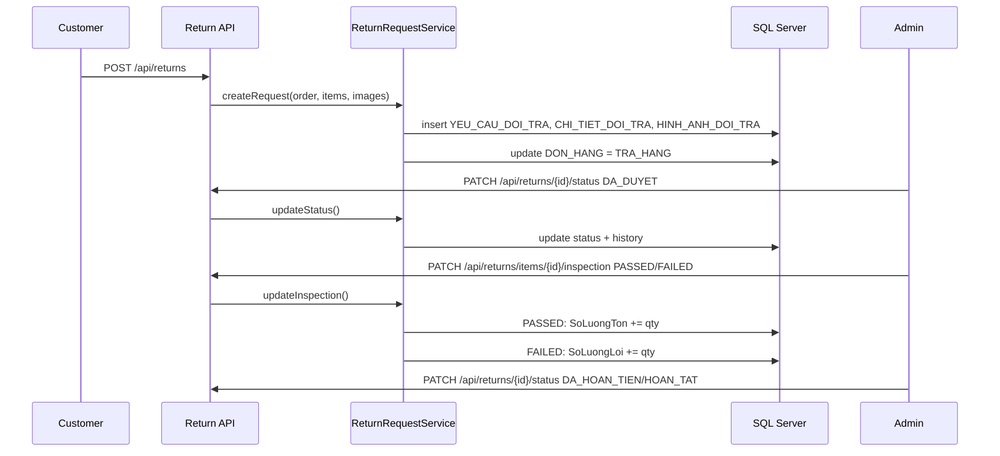

# Luồng trả hàng/hoàn hàng

## Trạng thái yêu cầu

- `CHO_DUYET`: khách vừa gửi yêu cầu.
- `DA_DUYET`: admin duyệt yêu cầu.
- `TU_CHOI`: admin từ chối, đơn quay về `HOAN_THANH`.
- `CHO_KIEM_DINH`: hàng trả đang/chờ kiểm định.
- `DA_HOAN_TIEN`: đã hoàn tiền cho khách.
- `HOAN_TAT`: đóng quy trình trả hàng.

## Kiểm định sản phẩm

- `PENDING_INSPECTION`: chưa kiểm định.
- `PASSED`: cộng lại `BienTheSanPham.SoLuongTon`.
- `FAILED`: không cộng tồn, cộng `BienTheSanPham.SoLuongLoi`.

## Flow xử lý

1. Khách gửi yêu cầu từ đơn `HOAN_THANH`, gồm lý do, mô tả, ảnh, số lượng từng sản phẩm, phương thức hoàn tiền.
2. Hệ thống tạo `YEU_CAU_DOI_TRA`, `CHI_TIET_DOI_TRA`, `HINH_ANH_DOI_TRA`, ghi `LICH_SU_XU_LY_DOI_TRA`.
3. Đơn hàng chuyển sang `TRA_HANG`, nhưng tồn kho chưa tăng.
4. Admin duyệt hoặc từ chối.
5. Khi hàng về kho, admin kiểm định từng dòng sản phẩm.
6. `PASSED` cộng tồn kho, `FAILED` cộng hàng lỗi.
7. Admin cập nhật hoàn tiền và hoàn tất.

## Sequence

